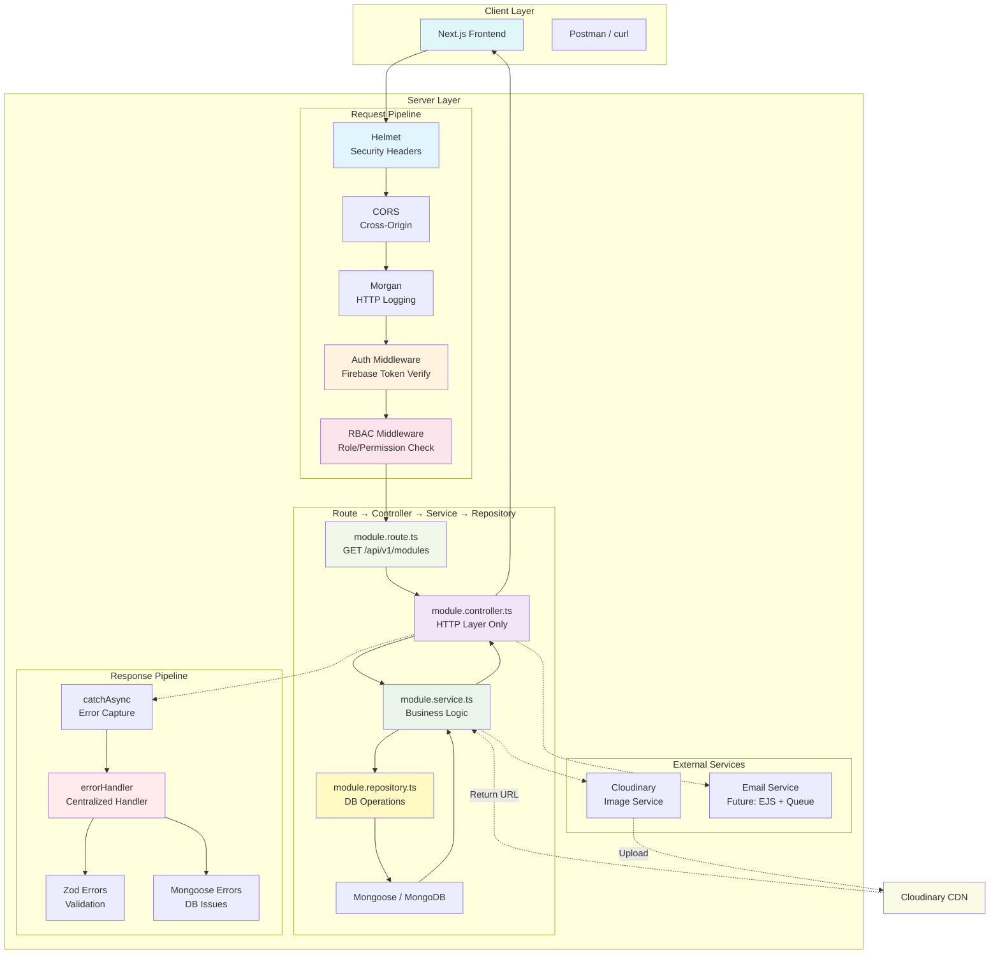
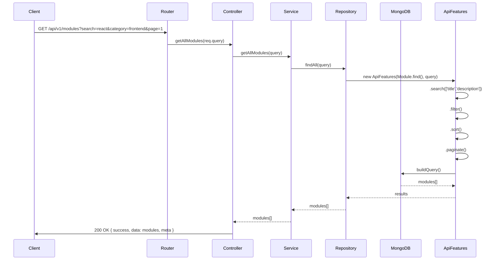
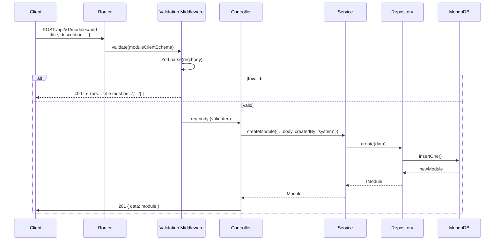
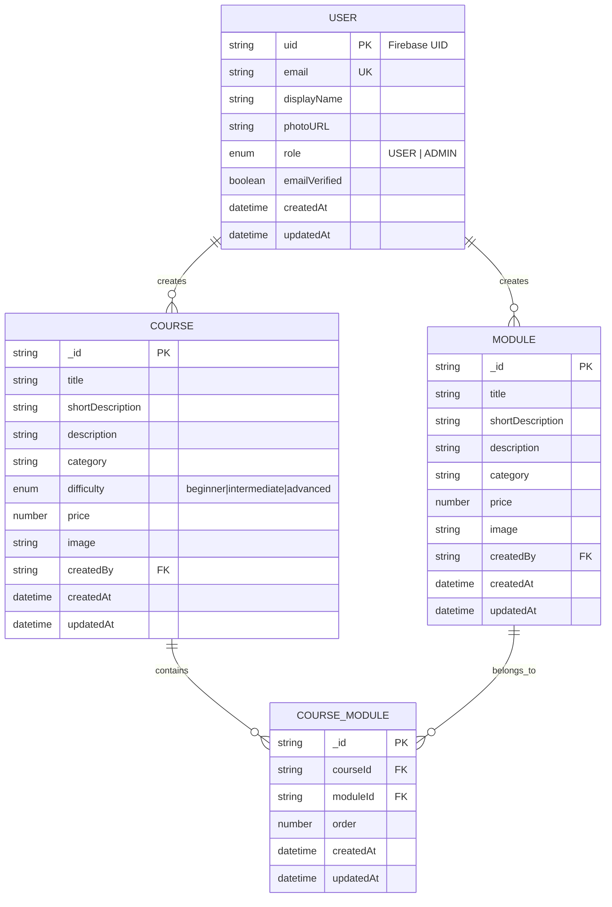
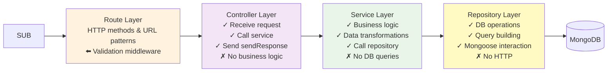
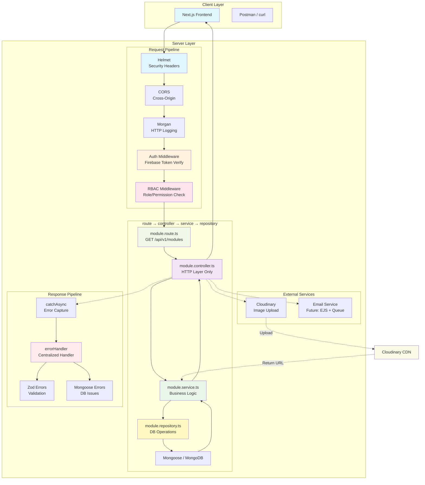
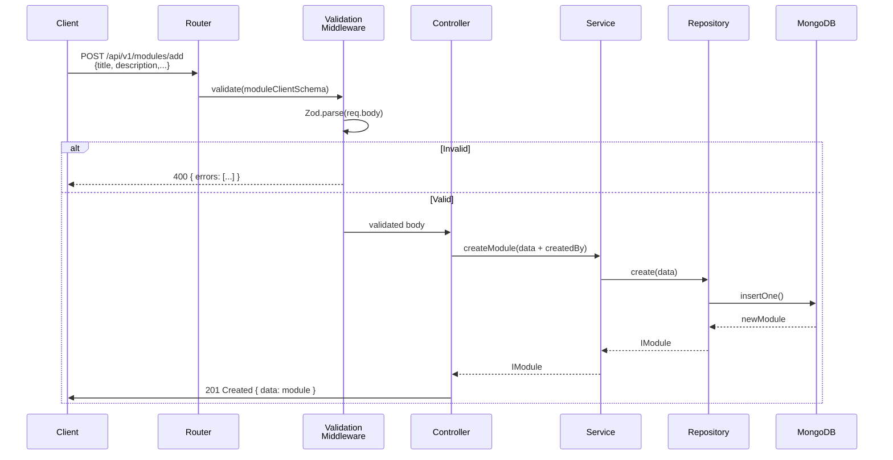
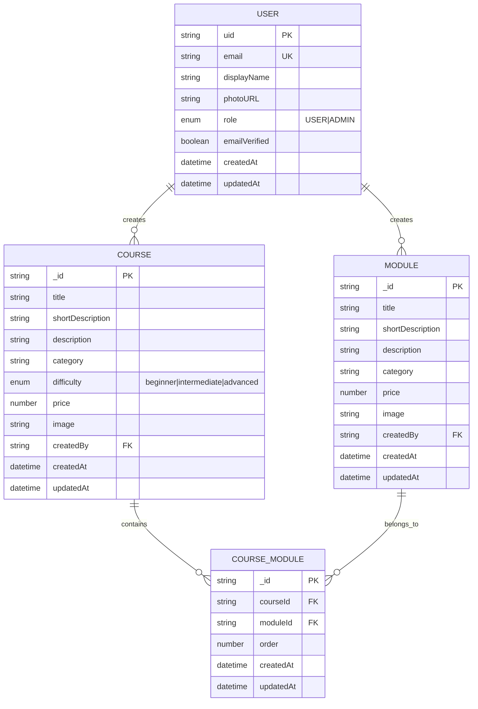
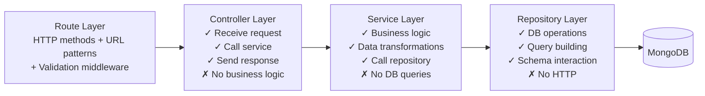

# 📚 StudyVault Backend API

A production-ready REST API built with **TypeScript + Express.js + Bun** for the *StudyVault* learning platform.

This backend provides secure, scalable, and modular APIs for managing **courses and learning modules** with filtering, course-module relationships, and Cloudinary-backed image handling inside service flows.

**Tech Stack:** TypeScript • Bun • Express.js • Mongoose • Zod • Helmet • CORS • Winston • Rate Limiting • Cloudinary

---

## 🚀 Features

### Core Features
- ✅ Courses & Modules CRUD (Create, Read, Update, Delete)
- ✅ Advanced Search, Filter, Sort, Pagination
- ✅ **Role-Based Access Control (RBAC)** with ADMIN/USER roles
- ✅ **Dual Authentication System**:
  - 🔐 Firebase/Google OAuth (ID token verification)
  - 📧 Local email/password with session cookies
- ✅ Cloud image upload & deletion (Cloudinary)
- ✅ Transaction rollback for image uploads (Cloudinary → DB atomicity)
- ✅ Automatic Cloudinary cleanup on course delete
- ✅ Centralized error handling (Zod, Mongoose, Multer)
- ✅ Input sanitization (XSS protection)
- ✅ Rate limiting (brute-force protection on auth endpoints)
- ✅ Centralized logging (Winston)
- ✅ Production security hardening
- ✅ Scalable modular architecture
- ✅ Course-Module linking (many-to-many)
- ✅ Admin: Link/unlink modules to courses with simplified endpoints (batch supported)

---

## 🧠 Architecture Highlights

- **Clean layered architecture**: Route → Controller → Service → Repository → Database
- **Single Responsibility**: Each layer has exactly one job
- **Centralized utilities**: `catchAsync`, `sendResponse`, `ApiFeatures`, `errorFormatter`
- **Security middleware**: Helmet, CORS, rate limiting, sanitization
- **Cloudinary integration**: Upload, transform, and delete images from service layer
- **Validation layer**: Zod schemas with simplified error messages
- **Centralized logging**: Winston logger with file + console transports
- **Production-grade**: Error handling, security, monitoring ready

---

# 🚀 Usage Instructions

## Prerequisites

- **Bun** (v1.0 or higher) - [Install Bun](https://bun.sh/docs/installation)
- **MongoDB** (local instance or MongoDB Atlas)
- **Node.js** (optional, if not using Bun)

## Installation

```bash
# Clone the repository
git clone git@github.com:Sarwarhridoy4/StudyVault.git
cd StudyVault/server

# Install dependencies
bun install
```

## Environment Setup

1. Copy the example environment file:
   ```bash
   cp .env.example .env
   ```

2. Update `.env` with your configuration:
   ```env
   # Server
   PORT=5000
   NODE_ENV=development

   # MongoDB
   MONGO_URI=mongodb://localhost:27017/studyvault

   # Cloudinary (for image uploads)
   CLOUDINARY_CLOUD_NAME=your_cloudinary_cloud_name
   CLOUDINARY_API_KEY=your_cloudinary_api_key
   CLOUDINARY_API_SECRET=your_cloudinary_api_secret

   # CORS (optional, default: * for dev)
   CORS_ORIGIN=*

   # Session secret (required for email/password auth)
   SESSION_SECRET=your-session-secret-key-change-in-production
   SESSION_MAX_AGE=604800000

    # Firebase (required for Google/SSO login)
    FIREBASE_PROJECT_ID=your_firebase_project_id
    FIREBASE_CLIENT_EMAIL=your_firebase_client_email
    FIREBASE_PRIVATE_KEY=your_firebase_private_key

    # Email (for password reset)
    EMAIL_HOST=smtp.example.com
    EMAIL_PORT=587
    EMAIL_SECURE=false
    EMAIL_USER=noreply@example.com
    EMAIL_PASS=your_email_password
    EMAIL_FROM=StudyVault <noreply@example.com>

    # Frontend URL (used in reset-password email link)
    FRONTEND_URL=http://localhost:3000
    ```

---

## 🚀 Usage Instructions

### Development Mode (with hot reload)
```bash
bun run dev
```
Uses nodemon to watch for changes and auto-restart.

### Production Mode
```bash
bun run start
```

### Build for Production
```bash
bun run build
```

### Seed Admin User (Optional)
```bash
bun run seed
```
Creates an admin user in the database (useful for testing admin endpoints).

## Verifying the Installation

Once the server is running, test the endpoints:

### Root Endpoint (Welcome Message)
```bash
curl http://localhost:5000/
```
Expected response:
```json
{
  "success": true,
  "message": "Welcome to StudyVault",
  "data": {
    "name": "StudyVault API",
    "version": "1.0.0",
    "description": "A learning platform marketplace",
    "endpoints": {
      "health": "/health",
      "courses": "/api/v1/courses",
      "modules": "/api/v1/modules",
      "courseModules": "/api/v1/coursemodule",
      "about": "/about"
    }
  },
  "meta": null
}
```

### Health Endpoint
```bash
curl http://localhost:5000/health
```
Expected response:
```json
{
  "status": "OK",
  "timestamp": "2026-04-24T11:30:15.123Z",
  "uptime": 123.45,
  "environment": "development",
  "system": {
    "platform": "linux",
    "arch": "x64",
    "nodeVersion": "v22.x.x",
    "memory": { "used": "10.50 MB", "total": "20.00 MB" },
    "pid": 12345
  }
}
```

## API Testing

### Health Check
```bash
curl http://localhost:5000/health
```

### Authentication

#### Register (Email/Password)
```bash
curl -X POST http://localhost:5000/api/v1/auth/register \
  -H "Content-Type: application/json" \
  -d '{"email":"user@example.com","password":"SecurePass123","displayName":"Test User"}'
```

#### Login (Email/Password)
```bash
curl -c cookies.txt -X POST http://localhost:5000/api/v1/auth/login \
  -H "Content-Type: application/json" \
  -d '{"email":"user@example.com","password":"SecurePass123"}'
```

#### Get Current User (using session cookie)
```bash
curl -b cookies.txt http://localhost:5000/api/v1/auth/me
```

#### Firebase Authentication
```bash
curl -X POST http://localhost:5000/api/v1/auth/firebase \
  -H "Content-Type: application/json" \
  -d '{"idToken":"<FIREBASE_ID_TOKEN_FROM_CLIENT>"}'
```

#### Forgot Password (Email-based reset)
```bash
curl -X POST http://localhost:5000/api/v1/auth/forgot-password \
  -H "Content-Type: application/json" \
  -d '{"email":"user@example.com"}'
```
In development, the response includes a `meta.token` field containing the reset token for testing. In production, only an email is sent.

#### Reset Password
```bash
curl -X POST http://localhost:5000/api/v1/auth/reset-password \
  -H "Content-Type: application/json" \
  -d '{"email":"user@example.com","token":"<token_from_email>","newPassword":"NewSecurePass123","confirmPassword":"NewSecurePass123"}'
```

### Create a Module (requires authentication)
```bash
curl -b cookies.txt -X POST http://localhost:5000/api/v1/modules/add \
  -H "Content-Type: application/json" \
  -d '{"title":"React Basics","shortDescription":"Learn React from scratch","description":"A beginner-friendly module covering components, props, state, and hooks.","category":"frontend","price":0,"image":"https://example.com/react-basics.jpg"}'
```

## Tech Stack

| Technology | Purpose |
|------------|---------|
| **Bun** | Runtime environment |
| **TypeScript** | Programming language |
| **Express.js** | Web framework |
| **Mongoose** | MongoDB ODM |
| **Zod** | Schema validation |
| **Helmet** | Security headers (CSP, HSTS) |
| **CORS** | Cross-origin resource sharing |
| **Morgan** | HTTP request logging (piped to Winston) |
| **Winston** | Centralized structured logging |
| **express-rate-limit** | Rate limiting (brute-force protection) |
| **dompurify** | XSS sanitization |
| **Cloudinary** | Image upload & CDN |
| **Multer** | Multipart form data parsing |
| **Nodemailer** | Email transport (password reset) |
| **EJS** | Email templating |
| **express-session** | Session management for local auth |
| **connect-mongodb-session** | MongoDB session store |

---

## 🔐 Authentication

The StudyVault backend supports two authentication methods:

### 1. Firebase / Google OAuth

Ideal for seamless social login.

**Flow:**
1. Frontend obtains Firebase ID token after Google sign-in via Firebase SDK.
2. Send token to `POST /api/v1/auth/firebase` with JSON body: `{ "idToken": "..." }`.
3. Backend verifies token using Firebase Admin SDK.
4. If UID is new → creates user record and returns `isNewUser: true`.
5. Session cookie is set for browser clients. The same user can continue with session or Bearer token.

**Token usage:**
- Include `Authorization: Bearer <ID_TOKEN>` header for stateless requests.
- Or rely on session cookie (automatically sent by browser).

### 2. Local Email/Password (Session-based)

Classic username/password auth with HTTP-only cookies.

**Endpoints:**
- `POST /api/v1/auth/register` – create account
- `POST /api/v1/auth/login` – sign in (creates session)
- `POST /api/v1/auth/logout` – destroy session
- `POST /api/v1/auth/forgot-password` – request password reset email
- `POST /api/v1/auth/reset-password` – reset password with token
- `GET /api/v1/auth/me` – get current user
- `PATCH /api/v1/auth/me` – update profile
- `DELETE /api/v1/auth/me` – delete account

**Session behavior:**
- Sessions are stored in MongoDB via `connect-mongodb-session`.
- Session cookie is HTTP-only, Secure in production, SameSite=Lax.
- Default expiry: 7 days (`SESSION_MAX_AGE` in env).

**Password Reset Flow:**
1. User calls `POST /api/v1/auth/forgot-password` with their email.
2. If account exists and uses local auth, system generates a secure token (valid 1 hour) and sends a password reset link to the user's email.
3. User clicks link in email → frontend routes to `/reset-password?token=ABC123`.
4. Frontend collects `email`, `token`, `newPassword`, `confirmPassword` and calls `POST /api/v1/auth/reset-password`.
5. On success, user can log in with new password.
6. For security, the reset token is single-use and expires after 1 hour.

### Protected Routes

Any route using the `auth` middleware accepts **either** a valid Firebase ID token **or** a valid session cookie. You don't need to choose one method—the backend will detect the session first, then fall back to Bearer token.

### Role-Based Access Control (RBAC)

After authentication, the `rbac` middleware enforces roles:

- Admin-only routes: `rbac('ADMIN')`
- Authenticated user routes: `rbac('USER', 'ADMIN')`

User roles from Firebase: automatically set to `USER` unless UID starts with `admin_`. Local registrations default to `USER`.

---

## 🧠 Architecture Highlights

```text
src/
 ├── app.ts                          # Express app setup & middleware
 ├── server.ts                       # Server entry point (Bun runtime)
 ├── config/
 │    ├── db.ts                      # MongoDB connection
 │    ├── env.ts                     # Environment variables
 │    ├── cloudinary.ts              # Cloudinary config
 │    └── session.ts                 # Express session configuration
 ├── middlewares/
 │    ├── auth.ts                    # Firebase + Session auth middleware
 │    ├── rbac.ts                    # Role-based access control
 │    ├── upload.ts                  # Multer file upload middleware
 │    ├── validation.ts              # Zod validation middleware factory
 │    ├── errorHandler.ts            # Centralized error handler
 │    └── sanitize.ts                # XSS sanitization
 ├── utils/
 │    ├── ApiFeatures.ts             # Query builder (search, filter, sort, paginate)
 │    ├── AppError.ts                # Custom error class
 │    ├── catchAsync.ts              # Async error wrapper HOF
 │    ├── errorFormatter.ts          # Zod error formatting
 │    ├── logger.ts                  # Winston logger
 │    └── sendResponse.ts            # Standardized response
 ├── errors/                         # Custom error classes
 │    ├── index.ts                   # Barrel export
 │    ├── AppError.ts
 │    ├── MongooseError.ts
 │    ├── AuthError.ts
 │    └── CloudinaryError.ts
 ├── services/
 │    ├── cloudinary.service.ts      # Cloudinary upload/delete
 │    ├── image.service.ts           # Transaction helpers with rollback
 │    ├── firebase.service.ts        # Firebase Admin SDK verification
 │    └── email.service.ts           # Email service (future)
 ├── modules/
 │    ├── course/                    # Course module
 │    │    ├── course.route.ts
 │    │    ├── course.controller.ts
 │    │    ├── course.service.ts
 │    │    ├── course.repository.ts
 │    │    ├── course.model.ts
 │    │    ├── course.types.ts
 │    │    └── course.validation.ts
 │    │
 │    ├── module/                    # Module module
 │    │    ├── module.route.ts
 │    │    ├── module.controller.ts
 │    │    ├── module.service.ts
 │    │    ├── module.repository.ts
 │    │    ├── module.model.ts
 │    │    ├── module.types.ts
 │    │    └── module.validation.ts
 │    │
 │    ├── coursemodule/              # Course-Module relationship
 │    │    ├── coursemodule.route.ts
 │    │    ├── coursemodule.controller.ts
 │    │    ├── coursemodule.service.ts
 │    │    ├── coursemodule.repository.ts
 │    │    ├── coursemodule.model.ts
 │    │    ├── coursemodule.types.ts
 │    │    └── coursemodule.validation.ts
 │    │
 │    ├── admin/                     # Admin module
 │    │    ├── admin.route.ts
 │    │    ├── admin.controller.ts
 │    │    └── admin.service.ts
 │    │
 │    ├── public/                    # Public pages
 │    │    ├── public.route.ts
 │    │    ├── public.controller.ts
 │    │    └── public.service.ts
 │    │
 │    └── user/                      # User & Authentication module
 │         ├── user.model.ts
 │         ├── user.types.ts
 │         ├── user.repository.ts
 │         ├── user.service.ts
 │         ├── user.controller.ts
 │         ├── user.route.ts
 │         └── user.validation.ts
 ├── emails/                         # Email templates (future)
 │    └── templates/
 └── queue/                          # Background job queues (future)
```

---

## 🏗️ System Architecture Flow



---

## 🔄 Request Flow Diagrams

### 1. GET /api/v1/modules (List with Filters)



---

### 2. POST /api/v1/modules/add (Create with Validation)



---

### 3. Course Image Upload Flow (POST /api/v1/courses)

```mermaid
graph TB
    A[Client POST /api/v1/courses<br/>multipart/form-data] --> B[Multer Middleware<br/>memoryStorage]
    B --> C{Validate?}
    C -->|Size > 5MB| D[400: File too large]
    C -->|Invalid MIME| E[400: Invalid file type]
    C -->|Valid| X[req.file.buffer]
    X --> Y[Course Service<br/>createWithImageTransaction]
    Y --> Z[Cloudinary Service<br/>uploadImage(buffer)]
    Z --> H{Cloudinary?}
    H -->|Success| I[201 Course created]
    H -->|Failed| J[500 CloudinaryError]
    I --> K[Client receives course with image URL]
```

---

## 📦 Payload Examples

### Full Item Schema

```json
{
  "id": "507f1f77bcf86cd799439011",
  "title": "React Masterclass",
  "shortDescription": "Learn React from zero to hero in 30 days",
  "description": "Complete React.js course covering Hooks, Context, Redux, Next.js, and best practices",
  "category": "frontend",
  "price": 49.99,
  "image": "https://res.cloudinary.com/dvlxx0b0q/image/upload/v1234567890/react-masterclass.jpg",
  "createdBy": "firebase_uid_abc123",
  "createdAt": "2026-04-24T10:00:00.000Z",
  "updatedAt": "2026-04-24T12:00:00.000Z"
}
```

---

### GET /api/v1/modules (List Response)

```json
{
  "success": true,
  "message": "Modules retrieved successfully",
  "data": [
    {
      "id": "507f1f77bcf86cd799439011",
      "title": "React Masterclass",
      "shortDescription": "Learn React from zero to hero",
      "description": "Complete React.js course",
      "category": "frontend",
      "price": 49.99,
      "image": "https://...",
      "createdBy": "user_123",
      "createdAt": "2026-04-24T10:00:00Z",
      "updatedAt": "2026-04-24T12:00:00Z"
    }
  ],
  "meta": {
    "page": 1,
    "limit": 10,
    "total": 50,
    "totalPages": 5
  }
}
```

---

### POST /api/v1/modules/add Request

```json
{
  "title": "Node.js Fundamentals",
  "shortDescription": "Master Node.js runtime",
  "description": "Learn event loop, streams, buffers, and build REST APIs",
  "category": "backend",
  "price": 29.99,
  "image": "https://example.com/nodejs.jpg"
}
```

**Note:** `createdBy` is injected by backend from authenticated user (not provided by client).

---

### Validation Error Response (Zod)

**Input:** `{ "title": "ab", "price": -5 }`

```json
{
  "success": false,
  "message": "Validation failed",
  "errors": [
    "Title must be at least 3 characters",
    "Short description must be at least 10 characters",
    "Description must be at least 20 characters",
    "Price cannot be negative"
  ],
  "data": null,
  "meta": null
}
```

---

### 404 Error Response

```json
{
  "success": false,
  "message": "Module not found",
  "data": null,
  "meta": null
}
```

---

### 409 Duplicate Key Error

```json
{
  "success": false,
  "message": "Duplicate field value: email. Please use a different value.",
  "data": null,
  "meta": null
}
```

---

### POST /api/v1/modules/add (Request Payload)

```json
{
  "title": "Node.js Fundamentals",
  "shortDescription": "Master Node.js runtime, event loop, and streams",
  "description": "Comprehensive guide to Node.js covering buffers, streams, events, and building REST APIs with Express",
  "category": "backend",
  "price": 29.99,
  "image": "https://example.com/nodejs-fundamentals.jpg"
}
```

> **Note:** `createdBy` is injected automatically from authenticated user, not provided by client.

---

### Validation Error Response (Zod Simplified)

**Failed request:** `{ "title": "ab", "price": -5 }`

```json
{
  "success": false,
  "message": "Validation failed",
  "errors": [
    "Title must be at least 3 characters",
    "Short description must be at least 10 characters",
    "Description must be at least 20 characters",
    "Price cannot be negative"
  ],
  "data": null,
  "meta": null
}
```

---

### 404 Item Not Found

```json
{
  "success": false,
  "message": "Item not found",
  "data": null,
  "meta": null
}
```

---

### 409 Duplicate Key Error

```json
{
  "success": false,
  "message": "Duplicate field value: email. Please use a different value.",
  "data": null,
  "meta": null
}
```

---

## 🔐 RBAC Protection Flow

```mermaid
graph LR
    A[Incoming Request] --> B{Firebase Token<br/>Valid?}
    B -->|No| C[401 Unauthorized]
    B -->|Yes| D[Attach req.user<br/>(uid, email, role)]
    D --> E{Role Check<br/>Required: USER?}
    E -->|Has Role| M[✅ Controller → Service]
    E -->|Missing Role| N[403 Forbidden]
    C --> H[errorHandler<br/>JSON Response]
    N --> H
```

---

## 📊 Data Model (ER Diagram)



---

## 🔍 Query System Flow

```mermaid
graph TD
    A[Client:<br/>GET /api/v1/modules?search=react<br/>&category=frontend&page=1&limit=10] --> B[Router]
    B --> C[Controller]
    C --> D[Service]
    D --> E[Repository]
    E --> Q[ApiFeatures Builder]
     
    Q --> Q1[.search(['title','shortDescription','description'])]
    Q1 --> Q2[.filter()<br/>category, priceMin/priceMax]
    Q2 --> Q3[.sort()<br/>default: -createdAt]
    Q3 --> Q4[.paginate()<br/>page, limit]
    Q4 --> Z[MongoDB Query]
    Z --> H[Execute]
    H --> I[Response:<br/>{success, data: modules, meta}]
```

---

## 🗂️ Module Structure Pattern (Per Module)



---

## 📊 API Quick Reference

| Method | Endpoint | Access | Description |
|--------|----------|--------|-------------|
| GET | `/` | Public | Landing page |
| GET | `/about` | Public | About page |
| GET | `/health` | Public | Health check |
| GET | `/api/v1/modules` | Public | List all modules (with filters) |
| GET | `/api/v1/modules/:id` | Public | Get single module |
| POST | `/api/v1/modules/add` | User | Create new module |
| PATCH | `/api/v1/modules/:id` | User | Update own module |
| DELETE | `/api/v1/modules/:id` | User | Delete own module |
| GET | `/api/v1/modules/manage` | User | List user's modules |
| GET | `/api/v1/courses` | Public | List all courses |
| GET | `/api/v1/courses/:id` | Public | Get single course |
| POST | `/api/v1/courses` | Admin | Create new course |
| PATCH | `/api/v1/courses/:id` | Admin | Update course |
| DELETE | `/api/v1/courses/:id` | Admin | Delete course |
| GET | `/api/v1/admin/modules` | Admin | View all modules |
| PATCH | `/api/v1/admin/modules/:id` | Admin | Edit any module |
| DELETE | `/api/v1/admin/modules/:id` | Admin | Delete any module |
| GET | `/api/v1/admin/courses` | Admin | View all courses |
| GET | `/api/v1/admin/users` | Admin | View all users |
| GET | `/api/v1/coursemodule/courses/:courseId/modules` | Admin | Get modules linked to a course |
| GET | `/api/v1/coursemodule/modules/:moduleId/courses` | Admin | Get courses linked to a module |
| POST | `/api/v1/coursemodule/courses/:courseId/modules` | Admin | Link one module or batch link modules |
| DELETE | `/api/v1/coursemodule/courses/:courseId/modules/:moduleId` | Admin | Unlink one module from a course |
| DELETE | `/api/v1/coursemodule/courses/:courseId/modules` | Admin | Batch unlink modules from a course |
| POST | `/api/v1/coursemodule/link` | Admin | Legacy single-link endpoint |
| POST | `/api/v1/coursemodule/batch/link` | Admin | Legacy batch-link endpoint |
| POST | `/api/v1/coursemodule/batch/unlink/:courseId` | Admin | Legacy batch-unlink endpoint |

---

## 🎯 Key Design Decisions

1. **Separate `types.ts` per module:** Keeps interfaces reusable across model, service, controller
2. **Validation middleware:** Zod errors auto-caught & formatted by centralized errorHandler
3. **Repository pattern:** All DB queries isolated, ApiFeatures reused across modules
4. **Cloudinary centralized:** Service helpers keep upload/delete logic out of controllers and routes
5. **Error hierarchy:** AppError → AuthError, CloudinaryError, MongooseError helpers
6. **No business logic in controllers:** Controllers only orchestrate, services handle logic
7. **Consistent response format:** Every endpoint returns `{ success, message, data, meta }`
8. **RBAC-ready:** Auth + RBAC middlewares registered globally, ready for route protection

---

This backend is **production-grade**, following strict clean architecture principles from AGENT.md.

## 🏗️ System Architecture Flow



---

## 🔄 Request Flow Diagrams

### 1. GET /api/v1/modules (List with Filters)


---

### 2. POST /api/v1/modules/add (Create)



---

### 3. Course Image Upload Flow (POST /api/v1/courses)

```mermaid
graph TB
    A[Client POST /api/v1/courses<br/>multipart/form-data] --> B[Upload Middleware<br/>Multer.memoryStorage]
    B --> C{Validate File?}
    C -->|Size > 5MB| D[400: File too large]
    C -->|Invalid MIME| E[400: Invalid file type]
    C -->|Valid| X[Buffer in req.file]
    X --> Y[Course Service<br/>image transaction helper]
    Y --> Z[Cloudinary Service<br/>uploader.upload(buffer)]
    Z --> H{Cloudinary Success?}
    H -->|Success| I[201 Created]
    H -->|Failed| J[500 CloudinaryError]
    I --> K[Client receives saved course]
```

---

## 📦 Payload Examples

### Module Model (Complete)

```json
{
  "_id": "507f1f77bcf86cd799439011",
  "title": "React Masterclass",
  "shortDescription": "Learn React from zero to hero in 30 days",
  "description": "Complete React.js course covering Hooks, Context, Redux, Next.js...",
  "category": "frontend",
  "price": 49.99,
  "image": "https://res.cloudinary.com/.../react-module.jpg",
  "createdBy": "firebase_uid_12345",
  "createdAt": "2026-04-24T10:00:00.000Z",
  "updatedAt": "2026-04-24T12:00:00.000Z"
}
```

---

### GET /api/v1/modules Response

```json
{
  "success": true,
  "message": "Modules retrieved successfully",
  "data": [
    {
      "id": "507f1f77bcf86cd799439011",
      "title": "React Basics",
      "shortDescription": "Learn React fast",
      "description": "Full module content...",
      "category": "frontend",
      "price": 0,
      "image": "https://example.com/image.jpg",
      "createdBy": "user123",
      "createdAt": "2026-04-24T10:00:00Z",
      "updatedAt": "2026-04-24T10:00:00Z"
    }
  ],
  "meta": {
    "page": 1,
    "limit": 10,
    "total": 50,
    "totalPages": 5
  }
}
```

---

### POST /api/v1/modules/add Request

```json
{
  "title": "Node.js Fundamentals",
  "shortDescription": "Master Node.js runtime",
  "description": "Learn event loop, streams, buffers, and build REST APIs",
  "category": "backend",
  "price": 29.99,
  "image": "https://example.com/nodejs.jpg"
}
```

**Note:** `createdBy` is injected by backend from authenticated user (not provided by client).

---

### Course Model (Complete)

```json
{
  "_id": "507f1f77bcf86cd799439012",
  "title": "Full-Stack Development",
  "shortDescription": "Master frontend and backend technologies",
  "description": "Complete full-stack course covering React, Node.js, and MongoDB",
  "category": "fullstack",
  "difficulty": "advanced",
  "price": 99.99,
  "image": "https://res.cloudinary.com/.../fullstack-course.jpg",
  "createdBy": "firebase_uid_12345",
  "createdAt": "2026-04-24T10:00:00.000Z",
  "updatedAt": "2026-04-24T12:00:00.000Z"
}
```

---

### GET /api/v1/courses Response (with modules)

```json
{
  "success": true,
  "message": "Courses retrieved successfully",
  "data": [
    {
      "id": "507f1f77bcf86cd799439012",
      "title": "Full-Stack Development",
      "shortDescription": "Master frontend and backend technologies",
      "description": "Complete full-stack course covering React, Node.js, and MongoDB",
      "category": "fullstack",
      "difficulty": "advanced",
      "price": 99.99,
      "image": "https://res.cloudinary.com/.../fullstack-course.jpg",
      "createdBy": "user123",
      "modules": [
        {
          "module": { "_id": "...", "title": "React Basics", ... },
          "order": 0
        },
        {
          "module": { "_id": "...", "title": "Node.js Fundamentals", ... },
          "order": 1
        }
      ],
      "createdAt": "2026-04-24T10:00:00Z",
      "updatedAt": "2026-04-24T10:00:00Z"
    }
  ],
  "meta": {
    "page": 1,
    "limit": 10,
    "total": 5,
    "totalPages": 1
  }
}
```

## 🛡️ RBAC Protection Flow

```mermaid
graph LR
    A[Request Arrives] --> B{Auth Middleware<br/>Verify Firebase Token}
    B -->|Invalid| C[401 Unauthorized]
    B -->|Valid| D[Attach req.user<br/>(uid, email, role)]
    D --> E{RBAC Middleware<br/>Check Role}
    E -->|User has role| P[✅ Allow]
    E -->|Missing role| Q[403 Forbidden]
    P --> H[Controller → Service]
```

---

## 📊 Data Model Relationships



---

## 🔍 Query System Flow

```mermaid
graph TD
    A[Client Request<br/>GET /api/v1/modules?search=react&category=frontend&page=1&limit=10] --> B[Router]
    B --> C[Controller]
    C --> D[Service]
    D --> E[Repository]
    E --> Q[ApiFeatures Builder]
     
    Q --> Q1[search(['title','description'])]
    Q1 --> Q2[filter(category, priceMin/priceMax)]
    Q2 --> Q3[sort(createdAt, price)]
    Q3 --> Q4[paginate(limit, skip)]
    Q4 --> Z[MongoDB Query Built]
    Z --> H[Execute & Return]
    
    H --> I[Response with meta:<br/>{page, limit, total, totalPages}]
```

---

## 🗂️ Module Structure Pattern (Per Module)



---

This system provides a **production-grade, scalable, and maintainable** backend architecture following clean design principles.


# 🔐 Authentication

Authentication is handled using Firebase (frontend) and verified via middleware.

Uses Firebase Authentication

### Auth Flow:

* Frontend logs in via Firebase
* Sends ID token to backend
* Backend verifies token and attaches `req.user`

---

# 🛡️ Authorization (RBAC)

Roles supported:

* `USER`
* `ADMIN`
* `SUPER_ADMIN`

Permission-based access also supported.

---

## Middleware Usage:

```js
authorize("ADMIN", "SUPER_ADMIN")
authorizePermission("course.delete")
```

---

# 📦 Course API (Main Resource)

## Base URL

```
/api/v1/courses
```

---

## 📌 Endpoints

### 1. Get All Courses

```
GET /api/v1/courses
```

### Query Parameters:

```
?search=react
?category=frontend
?difficulty=beginner
?priceMin=0&priceMax=100
?sort=-createdAt
?page=1&limit=10
```

---

### 2. Get Single Course

```
GET /api/v1/courses/:id
```

---

### 3. Create Course (Protected - Admin only)

```
POST /api/v1/courses
```

### Body:

```json
{
  "title": "React Basics",
  "shortDescription": "Learn React fast",
  "description": "Full course content...",
  "category": "frontend",
  "difficulty": "beginner",
  "price": 0,
  "image": "url",
  "createdBy": "userId"
}
```

---

### 4. Update Course (Protected - Admin only)

```
PATCH /api/v1/courses/:id
```

---

### 5. Delete Course (Protected - Admin only)

```
DELETE /api/v1/courses/:id
```

---

# 🔍 Search / Filter / Sort System

All listing APIs support:

## Search Fields:

* title
* description
* shortDescription

## Filters:

* category
* difficulty
* price range

## Sorting:

* newest
* oldest
* price
* popularity (future-ready)

## Pagination:

```
?page=1&limit=10
```

---

# 📤 File Upload System

Uses:

* Multer
* Cloudinary

---

## Upload Rules:

* Validate file type (images only)
* Limit file size (e.g. 2MB)
* Store image URL + public_id in DB

---

## Upload Flow:

```
Validate → Multer → Cloudinary → Save DB
```

---

## Delete Flow:

```
Delete DB → Delete Cloudinary file
```

---

## Critical Rule:

If DB fails after upload → **Cloudinary file must be deleted (rollback required)**

---

# 🔄 Transactions & Rollback

Used when multiple dependent operations occur:

Example:

```
Create Study
Upload Image
Save DB
Send Email (optional)
```

If any step fails:

* rollback DB
* delete uploaded file
* abort request safely

Uses Mongoose sessions if MongoDB is used.

---

# 📧 Email System (Optional Extension)

* EJS templates
* centralized email service
* optional queue processing

Templates:

```
welcome.ejs
reset-password.ejs
```

Optional queue system:

* BullMQ
* Redis

---

# ⚙️ Utility System

## 1. catchAsync

Handles async errors globally.

## 2. sendResponse

Standard API response format:

```json
{
  "success": true,
  "message": "Success",
  "meta": {},
  "data": {}
}
```

## 3. AppError

Custom error handler for operational errors.

## 4. ApiFeatures

Centralized query engine for:

* search
* filter
* sort
* pagination

---

# 🔐 Security Standards

* Helmet enabled
* CORS configured
* Rate limiting enabled
* Input validation required
* Environment variables used for secrets

---

# 🧪 Validation Rules

All inputs must be validated using:

* Joi OR Zod

Required validation:

* title
* description
* category
* difficulty
* price
* image

---

# 📡 API ROUTES SUMMARY

## Public (No Auth)

```
GET  /                    Landing page
GET  /about               About page
GET  /health              Health check
GET  /api/v1/modules      List all modules (with filters)
GET  /api/v1/modules/:id  Get single module
GET  /api/v1/courses      List all courses
GET  /api/v1/courses/:id  Get single course
```

---

## User Protected (Auth Recommended - Not Enforced)

**Routes exist but authentication is NOT currently enforced.** These endpoints are open to anyone.

```
POST /api/v1/modules/add     Create module (no auth check - placeholder createdBy used)
PATCH /api/v1/modules/:id    Update own module (no auth check)
DELETE /api/v1/modules/:id   Delete own module (no auth check)
GET  /api/v1/modules/manage  Get user's modules (returns 'system' user modules)
POST /api/v1/courses         Create course (admin only - no auth check)
PATCH /api/v1/courses/:id    Update course (admin only - no auth check)
DELETE /api/v1/courses/:id   Delete course (admin only - no auth check)
```

**To enable protection:**
- Add `auth` middleware to these routes
- Update controller to use `req.user.uid` (currently uses `'system'` placeholder)
- See `src/middlewares/auth.ts` (skeleton exists, needs Firebase implementation)

---

## Admin Protected (Admin Role - Not Enforced)

**Routes exist but RBAC is NOT currently enforced.** Anyone can access these endpoints.

```
GET  /api/v1/admin/modules                                View all modules
PATCH /api/v1/admin/modules/:id                           Edit any module
DELETE /api/v1/admin/modules/:id                          Delete any module
GET  /api/v1/admin/courses                                View all courses
GET  /api/v1/admin/users                                  View all users
GET  /api/v1/coursemodule/courses/:courseId/modules       Get modules linked to a course
GET  /api/v1/coursemodule/modules/:moduleId/courses       Get courses linked to a module
POST /api/v1/coursemodule/courses/:courseId/modules       Link one or many modules to a course
DELETE /api/v1/coursemodule/courses/:courseId/modules/:moduleId  Unlink one module from a course
DELETE /api/v1/coursemodule/courses/:courseId/modules     Batch unlink modules from a course
POST /api/v1/coursemodule/link                            Legacy single-link endpoint
POST /api/v1/coursemodule/batch/link                      Legacy batch-link endpoint
POST /api/v1/coursemodule/batch/unlink/:courseId          Legacy batch-unlink endpoint
```

**To enable protection:**
- Add `auth` middleware + `authorize('ADMIN')` to these routes
- See `src/middlewares/rbac.ts` (skeleton exists)

---

## File Upload

There is no standalone `/api/v1/upload` endpoint anymore.

- Course image uploads happen in `POST /api/v1/courses` and `PATCH /api/v1/courses/:id`
- Multer parses the multipart file
- Service helpers upload to Cloudinary and handle cleanup/rollback when needed

---

## Auth (Firebase - NOT IMPLEMENTED)

The following endpoints are **not yet built**. They are required for the Odyssey assessment.

```
POST /api/v1/auth/login
POST /api/v1/auth/register
POST /api/v1/auth/logout
GET  /api/v1/auth/me
```

**Status:** Auth middleware skeleton exists (`src/middlewares/auth.ts`) but is non-functional. Routes are commented out in `app.ts`.

**Implementation needed:** See `IMPROVEMENTS.md` for full plan.

---

# 🚫 FORBIDDEN PRACTICES

❌ No business logic in controllers
❌ No duplicate filtering logic
❌ No raw res.json inconsistencies
❌ No direct Cloudinary calls in controllers
❌ No missing rollback handling
❌ No unvalidated inputs
❌ No insecure routes
❌ No `console.log` in production (use Winston)
❌ No fat controllers

---

## 🔐 Security Implementation

### Rate Limiting (AGENT.md Requirement ✅)
- Global: 100 requests per 15 minutes per IP
- Auth endpoints (when added): 5 requests per hour per IP
- Item operations: 30 requests per hour per IP
- Implemented via `express-rate-limit` in `src/middlewares/rateLimiter.ts`

### Input Sanitization (AGENT.md Requirement ✅)
- XSS protection using sanitization middleware
- Removes HTML tags, scripts, event handlers, `javascript:` URLs
- Applied to text fields (title, description, category, image URL)
- Implemented in `src/middlewares/sanitize.ts`

### Security Headers (AGENT.md Requirement ✅)
- Helmet.js with Content Security Policy (CSP)
- CORS configurable via environment variable
- HSTS, XSS Protection, and other headers enabled
- Configured in `src/app.ts`

### Protected Routes (Partially Implemented ⚠️)
- Auth middleware skeleton exists (`src/middlewares/auth.ts`)
- RBAC middleware skeleton exists (`src/middlewares/rbac.ts`)
- Partially wired in routes, but middleware logic is still placeholder-only
- Item create/update/delete routes currently open
- Admin and course-module routes currently rely on placeholder auth/RBAC implementations

---

# ⚡ PERFORMANCE RULES

* Always use pagination
* Avoid blocking synchronous operations
* Use async file handling
* Use queues for heavy tasks

---

# 🧱 DESIGN PRINCIPLES

* DRY (Don't Repeat Yourself)
* SRP (Single Responsibility Principle)
* Separation of Concerns
* Modular architecture
* Reusable utilities

---

# 🏁 DEPLOYMENT NOTES

* Use environment variables (.env)
* Use production DB credentials
* Enable logging system
* Ensure Cloudinary keys are secure

---

# 🎯 FINAL GOAL

This backend must be:

✔ scalable like SaaS
✔ secure by default
✔ frontend-ready (Next.js integration)
✔ modular and reusable
✔ production-grade architecture

---

# 📌 Summary

StudyVault Backend is a fully structured API system designed for:

* learning platform applications
* SaaS expansion
* frontend integration (Next.js + Firebase)
* scalable cloud deployment

---

```
