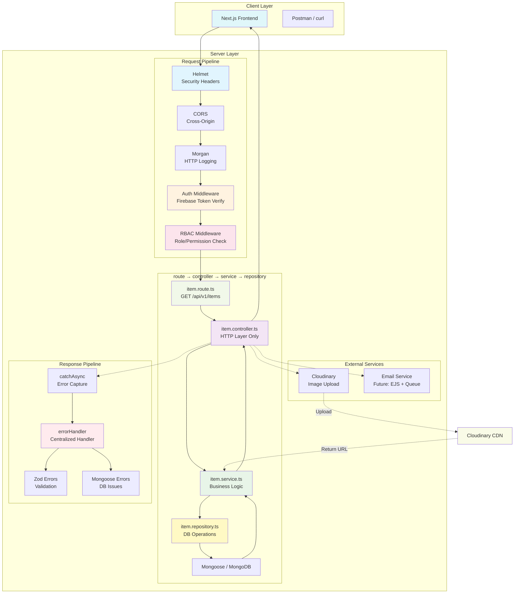
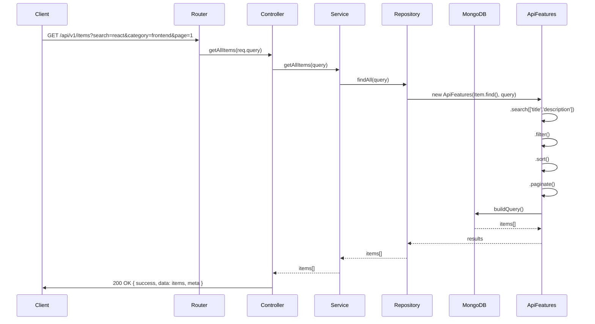
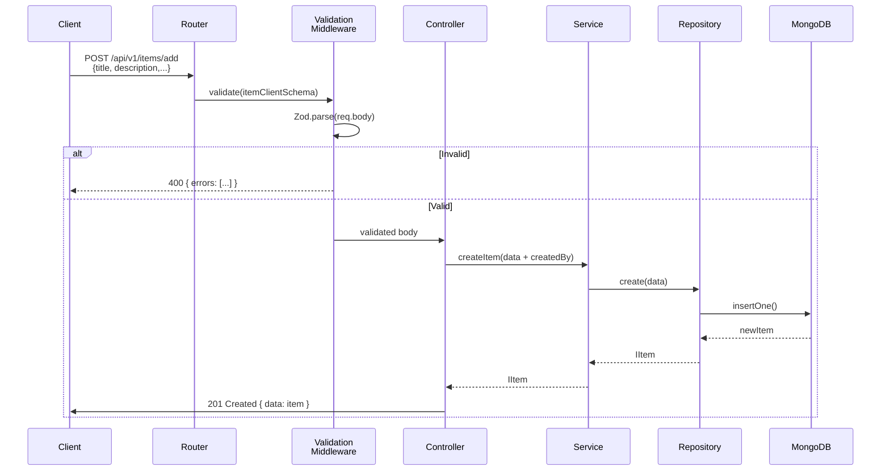
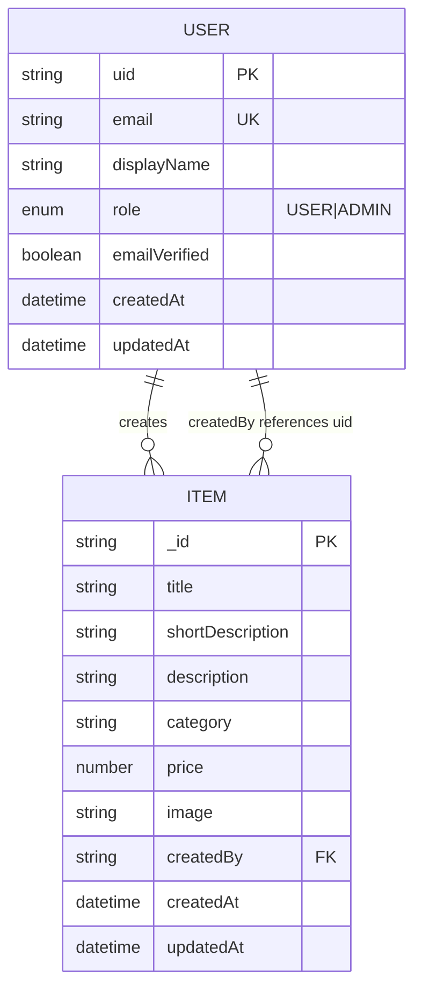
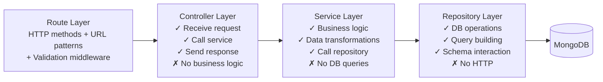

# 📚 StudyVault Backend API

A production-ready REST API built with **TypeScript + Express.js + Bun** for the *StudyVault* learning platform.

This backend provides secure, scalable, and modular APIs for managing **study items (courses / learning modules)** with authentication, filtering, file uploads, and role-based access control.

**Tech Stack:** TypeScript • Bun • Express.js • Mongoose • Zod • Helmet • CORS • Morgan

---

# 🚀 Features

## Core Features
- Study Items CRUD (Create, Read, Update, Delete)
- Advanced Search, Filter, Sort, Pagination
- Role-Based Access Control (RBAC)
- Firebase Auth-ready middleware
- Cloud image upload & deletion
- Centralized error handling
- Transaction-safe operations
- Scalable modular architecture

---

## 🧠 Architecture Highlights

- Clean layered architecture (Controller → Service → Repository)
- Centralized utilities (`catchAsync`, `sendResponse`, `ApiFeatures`)
- Secure middleware system
- Cloudinary integration for file storage
- Validation layer (Joi/Zod ready)
- Production-grade folder structure

---

# 🚀 Usage Instructions

## Prerequisites

- **Bun** (v1.0 or higher) - [Install Bun](https://bun.sh/docs/installation)
- **MongoDB** (local instance or MongoDB Atlas)
- **Node.js** (optional, if not using Bun)

## Installation

```bash
# Clone the repository
git clone git@github.com:Sarwarhridoy4/StudyVault.git
cd StudyVault/server

# Install dependencies
bun install
```

## Environment Setup

1. Copy the example environment file:
   ```bash
   cp .env.example .env
   ```

2. Update `.env` with your configuration:
   ```env
   PORT=5000
   NODE_ENV=development
   MONGO_URI=mongodb://localhost:27017/studyvault
   FIREBASE_PROJECT_ID=your_firebase_project_id
   FIREBASE_CLIENT_EMAIL=your_firebase_client_email
   FIREBASE_PRIVATE_KEY=your_firebase_private_key
   CLOUDINARY_CLOUD_NAME=your_cloudinary_cloud_name
   CLOUDINARY_API_KEY=your_cloudinary_api_key
   CLOUDINARY_API_SECRET=your_cloudinary_api_secret
   ```

## Running the Server

### Development Mode (with hot reload)
```bash
bun run dev
```
Uses nodemon to watch for changes and auto-restart.

### Production Mode
```bash
bun run start
```

### Build for Production
```bash
bun run build
```

## Verifying the Installation

Once the server is running, test the endpoints:

### Root Endpoint (Welcome Message)
```bash
curl http://localhost:5000/
```
Expected response:
```json
{
  "success": true,
  "message": "Welcome to StudyVault Backend API",
  "name": "StudyVault API",
  "version": "1.0.0",
  "environment": "development",
  "timestamp": "2026-04-24T11:32:30.000Z",
  "endpoints": {
    "health": "/health",
    "api": "/api/v1",
    "studies": "/api/v1/studies"
  }
}
```

### Health Endpoint
```bash
curl http://localhost:5000/health
```
Expected response:
```json
{
  "status": "OK",
  "timestamp": "2026-04-24T11:30:15.123Z",
  "uptime": 123.45,
  "environment": "development",
  "system": {
    "platform": "linux",
    "arch": "x64",
    "nodeVersion": "v22.x.x",
    "memory": { "used": "10.50 MB", "total": "20.00 MB" },
    "pid": 12345
  }
}
```

## API Testing

### Get All Studies
```bash
curl http://localhost:5000/api/v1/studies
```

### Create a Study (Protected - requires auth)
```bash
curl -X POST http://localhost:5000/api/v1/studies \
  -H "Content-Type: application/json" \
  -d '{
    "title": "React Basics",
    "shortDescription": "Learn React fast",
    "description": "Complete React course for beginners",
    "category": "frontend",
    "difficulty": "beginner",
    "price": 0,
    "image": "https://example.com/image.jpg",
    "createdBy": "userId"
  }'
```

### Search with Filters
```bash
curl "http://localhost:5000/api/v1/studies?search=react&category=frontend&page=1&limit=10"
```

## Tech Stack

| Technology | Purpose |
|------------|---------|
| **Bun** | Runtime environment |
| **TypeScript** | Programming language |
| **Express.js** | Web framework |
| **Mongoose** | MongoDB ODM |
| **Zod** | Schema validation |
| **Helmet** | Security headers |
| **CORS** | Cross-origin resource sharing |
| **Morgan** | HTTP request logger |
| **Nodemon** | Development auto-reload |

---

# 📁 Project Structure

```text
src/
 ├── app.ts
 ├── server.ts
 ├── config/
 │    ├── env.ts
 │    ├── db.ts
 │    ├── cloudinary.ts
 ├── modules/
 │    ├── item/
 │    │    ├── item.route.ts
 │    │    ├── item.controller.ts
 │    │    ├── item.service.ts
 │    │    ├── item.repository.ts
 │    │    ├── item.model.ts
 │    │    ├── item.types.ts
 │    │    ├── item.validation.ts
 │    ├── user/
 │    │    ├── user.model.ts
 │    │    ├── user.types.ts
 │    ├── admin/
 │    │    └── admin.route.ts
 │    ├── public/
 │    │    └── public.route.ts
 │    └── upload/
 │         └── upload.route.ts
 ├── middlewares/
 │    ├── auth.ts
 │    ├── rbac.ts
 │    ├── upload.ts
 │    ├── validation.ts
 │    ├── errorHandler.ts
 ├── utils/
 │    ├── catchAsync.ts
 │    ├── sendResponse.ts
 │    ├── AppError.ts
 │    ├── ApiFeatures.ts
 │    └── errorFormatter.ts
 ├── services/
 │    ├── cloudinary.service.ts
 │    └── email.service.ts
 ├── errors/
 │    ├── index.ts
 │    ├── AppError.ts
 │    ├── MongooseError.ts
 │    ├── AuthError.ts
 │    └── CloudinaryError.ts
 ├── emails/
 │    └── templates/
 └── queue/
```

---

## 🏗️ System Architecture Flow



---

## 🔄 Request Flow Diagrams

### 1. GET /api/v1/items (List with Filters)



---

### 2. POST /api/v1/items/add (Create)



---

### 3. Upload Image Flow (POST /api/v1/upload)

```mermaid
graph TB
    A[Client POST /api/v1/upload<br/>multipart/form-data] --> B[Upload Middleware<br/>Multer.memoryStorage]
    B --> C{Validate File?}
    C -->|Size > 5MB| D[400: File too large]
    C -->|Invalid MIME| E[400: Invalid file type]
    C -->|Valid| F[Buffer in req.file]
    F --> G[Cloudinary Service<br/>uploader.upload(buffer)]
    G --> H{Cloudinary Success?}
    H -->|Success| I[200 { url: secure_url }]
    H -->|Failed| J[500 CloudinaryError]
    I --> K[Client receives image URL]
```

---

## 📦 Payload Examples

### Item Model (Complete)

```json
{
  "_id": "507f1f77bcf86cd799439011",
  "title": "React Masterclass",
  "shortDescription": "Learn React from zero to hero in 30 days",
  "description": "Complete React.js course covering Hooks, Context, Redux, Next.js...",
  "category": "frontend",
  "difficulty": "intermediate",
  "price": 49.99,
  "image": "https://res.cloudinary.com/.../react-course.jpg",
  "createdBy": "firebase_uid_12345",
  "createdAt": "2026-04-24T10:00:00.000Z",
  "updatedAt": "2026-04-24T12:00:00.000Z"
}
```

---

### GET /api/v1/items Response

```json
{
  "success": true,
  "message": "Items retrieved successfully",
  "data": [
    {
      "id": "507f1f77bcf86cd799439011",
      "title": "React Basics",
      "shortDescription": "Learn React fast",
      "description": "Full course content...",
      "category": "frontend",
      "price": 0,
      "image": "https://example.com/image.jpg",
      "createdBy": "user123",
      "createdAt": "2026-04-24T10:00:00Z",
      "updatedAt": "2026-04-24T10:00:00Z"
    }
  ],
  "meta": {
    "page": 1,
    "limit": 10,
    "total": 50,
    "totalPages": 5
  }
}
```

---

### POST /api/v1/items/add Request

```json
{
  "title": "Node.js Fundamentals",
  "shortDescription": "Master Node.js runtime",
  "description": "Learn event loop, streams, buffers, and build REST APIs",
  "category": "backend",
  "price": 29.99,
  "image": "https://example.com/nodejs.jpg"
}
```

**Note:** `createdBy` is injected by backend from authenticated user (not provided by client).

---

### Validation Error Response (Zod)

**Input:** `{ "title": "ab", "price": -5 }`

```json
{
  "success": false,
  "message": "Validation failed",
  "errors": [
    "Title must be at least 3 characters",
    "Short description must be at least 10 characters",
    "Description must be at least 20 characters",
    "Price cannot be negative"
  ],
  "data": null,
  "meta": null
}
```

---

### 404 Error Response

```json
{
  "success": false,
  "message": "Item not found",
  "data": null,
  "meta": null
}
```

---

### 409 Duplicate Key Error

```json
{
  "success": false,
  "message": "Duplicate field value: email. Please use a different value.",
  "data": null,
  "meta": null
}
```

---

## 🛡️ RBAC Protection Flow

```mermaid
graph LR
    A[Request Arrives] --> B{Auth Middleware<br/>Verify Firebase Token}
    B -->|Invalid| C[401 Unauthorized]
    B -->|Valid| D[Attach req.user<br/>{uid, email, role}]
    D --> E{RBAC Middleware<br/>Check Role}
    E -->|User has role| F[✅ Allow]
    E -->|Missing role| G[403 Forbidden]
    F --> H[Controller → Service]
```

---

## 📊 Data Model Relationships



---

## 🔍 Query System Flow

```mermaid
graph TD
    A[Client Request<br/>GET /api/v1/items?search=react&category=frontend&page=1&limit=10] --> B[Router]
    B --> C[Controller]
    C --> D[Service]
    D --> E[Repository]
    E --> F[ApiFeatures Builder]
    
    F --> F1[search(['title','description'])]
    F1 --> F2[filter(category, priceMin, priceMax)]
    F2 --> F3[sort(createdAt, price)]
    F3 --> F4[paginate(limit, skip)]
    F4 --> G[MongoDB Query Built]
    G --> H[Execute & Return]
    
    H --> I[Response with meta:<br/>{page, limit, total, totalPages}]
```

---

## 🗂️ Module Structure Pattern (Per Module)



---

This system provides a **production-grade, scalable, and maintainable** backend architecture following clean design principles.


# 🔐 Authentication

Authentication is handled using Firebase (frontend) and verified via middleware.

Uses Firebase Authentication

### Auth Flow:

* Frontend logs in via Firebase
* Sends ID token to backend
* Backend verifies token and attaches `req.user`

---

# 🛡️ Authorization (RBAC)

Roles supported:

* `USER`
* `ADMIN`
* `SUPER_ADMIN`

Permission-based access also supported.

---

## Middleware Usage:

```js
authorize("ADMIN", "SUPER_ADMIN")
authorizePermission("study.delete")
```

---

# 📦 Study API (Main Resource)

## Base URL

```
/api/v1/studies
```

---

## 📌 Endpoints

### 1. Get All Studies

```
GET /api/v1/studies
```

### Query Parameters:

```
?search=react
?category=frontend
?difficulty=beginner
?priceMin=0&priceMax=100
?sort=-createdAt
?page=1&limit=10
```

---

### 2. Get Single Study

```
GET /api/v1/studies/:id
```

---

### 3. Create Study (Protected)

```
POST /api/v1/studies
```

### Body:

```json
{
  "title": "React Basics",
  "shortDescription": "Learn React fast",
  "description": "Full module content...",
  "category": "frontend",
  "difficulty": "beginner",
  "price": 0,
  "image": "url",
  "createdBy": "userId"
}
```

---

### 4. Update Study (Protected)

```
PATCH /api/v1/studies/:id
```

---

### 5. Delete Study (Protected)

```
DELETE /api/v1/studies/:id
```

---

# 🔍 Search / Filter / Sort System

All listing APIs support:

## Search Fields:

* title
* description
* shortDescription

## Filters:

* category
* difficulty
* price range

## Sorting:

* newest
* oldest
* price
* popularity (future-ready)

## Pagination:

```
?page=1&limit=10
```

---

# 📤 File Upload System

Uses:

* Multer
* Cloudinary

---

## Upload Rules:

* Validate file type (images only)
* Limit file size (e.g. 2MB)
* Store image URL + public_id in DB

---

## Upload Flow:

```
Validate → Multer → Cloudinary → Save DB
```

---

## Delete Flow:

```
Delete DB → Delete Cloudinary file
```

---

## Critical Rule:

If DB fails after upload → **Cloudinary file must be deleted (rollback required)**

---

# 🔄 Transactions & Rollback

Used when multiple dependent operations occur:

Example:

```
Create Study
Upload Image
Save DB
Send Email (optional)
```

If any step fails:

* rollback DB
* delete uploaded file
* abort request safely

Uses Mongoose sessions if MongoDB is used.

---

# 📧 Email System (Optional Extension)

* EJS templates
* centralized email service
* optional queue processing

Templates:

```
welcome.ejs
reset-password.ejs
```

Optional queue system:

* BullMQ
* Redis

---

# ⚙️ Utility System

## 1. catchAsync

Handles async errors globally.

## 2. sendResponse

Standard API response format:

```json
{
  "success": true,
  "message": "Success",
  "meta": {},
  "data": {}
}
```

## 3. AppError

Custom error handler for operational errors.

## 4. ApiFeatures

Centralized query engine for:

* search
* filter
* sort
* pagination

---

# 🔐 Security Standards

* Helmet enabled
* CORS configured
* Rate limiting enabled
* Input validation required
* Environment variables used for secrets

---

# 🧪 Validation Rules

All inputs must be validated using:

* Joi OR Zod

Required validation:

* title
* description
* category
* difficulty
* price
* image

---

# 📡 API ROUTES SUMMARY

## Public (No Auth)

```
GET  /                    Landing page
GET  /about               About page
GET  /health              Health check
GET  /api/v1/items        List all items (with filters)
GET  /api/v1/items/:id    Get single item
```

---

## User Protected (Auth Required - planned)

```
POST /api/v1/items/add     Create item
PATCH /api/v1/items/:id    Update own item
DELETE /api/v1/items/:id   Delete own item
GET  /api/v1/items/manage  Get user's items
```

---

## Admin Protected (Admin Role - planned)

```
GET  /api/v1/admin/items      View all items
PATCH /api/v1/admin/items/:id Edit any item
DELETE /api/v1/admin/items/:id  Delete any item
GET  /api/v1/admin/users      View all users
```

---

## File Upload

```
POST /api/v1/upload      Upload image to Cloudinary
DELETE /api/v1/upload/:publicId  Delete Cloudinary image
```

---

## Auth (Firebase - planned)

```
POST /api/v1/auth/login
POST /api/v1/auth/register
POST /api/v1/auth/logout
GET  /api/v1/auth/me
```

---

# 🚫 FORBIDDEN PRACTICES

❌ No business logic in controllers
❌ No duplicate filtering logic
❌ No raw res.json inconsistencies
❌ No direct Cloudinary calls in controllers
❌ No missing rollback handling
❌ No unvalidated inputs
❌ No insecure routes
❌ No console.log in production
❌ No fat controllers

---

# ⚡ PERFORMANCE RULES

* Always use pagination
* Avoid blocking synchronous operations
* Use async file handling
* Use queues for heavy tasks

---

# 🧱 DESIGN PRINCIPLES

* DRY (Don't Repeat Yourself)
* SRP (Single Responsibility Principle)
* Separation of Concerns
* Modular architecture
* Reusable utilities

---

# 🏁 DEPLOYMENT NOTES

* Use environment variables (.env)
* Use production DB credentials
* Enable logging system
* Ensure Cloudinary keys are secure

---

# 🎯 FINAL GOAL

This backend must be:

✔ scalable like SaaS
✔ secure by default
✔ frontend-ready (Next.js integration)
✔ modular and reusable
✔ production-grade architecture

---

# 📌 Summary

StudyVault Backend is a fully structured API system designed for:

* learning platform applications
* SaaS expansion
* frontend integration (Next.js + Firebase)
* scalable cloud deployment

---

```
