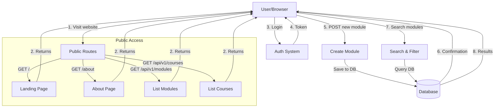
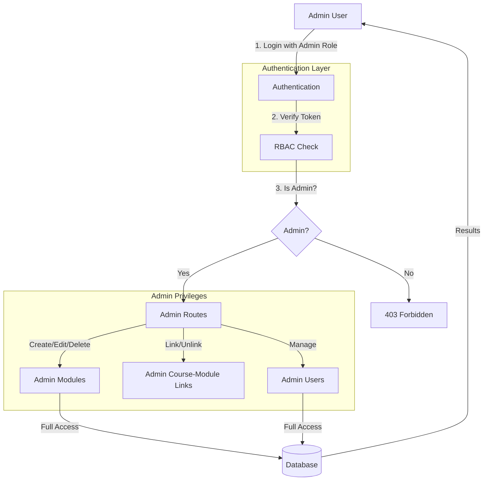
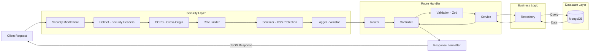
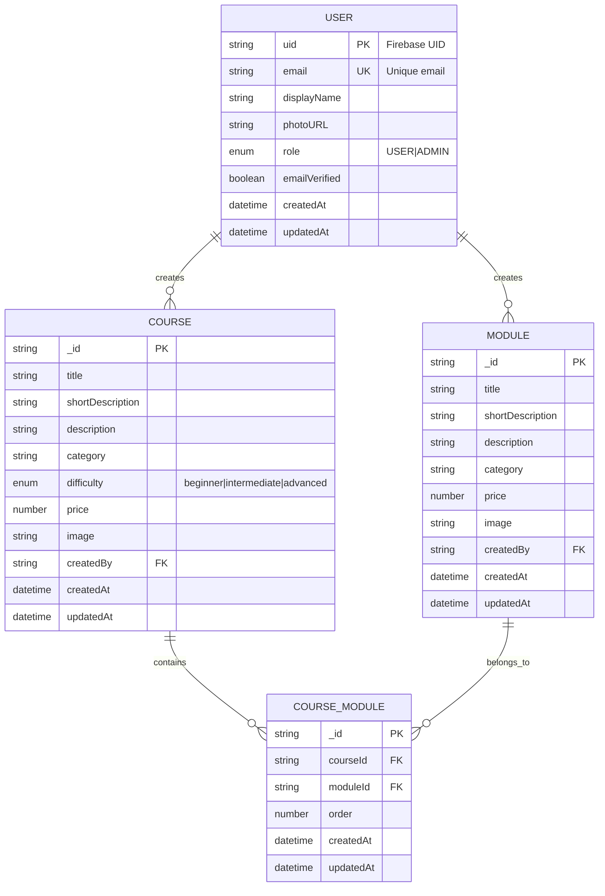

# System Overview - StudyVault Backend

## Simple Explanation

StudyVault is a learning platform backend that lets users create, manage, and find learning modules organized into courses. Think of it like a library system where:

- **Admins** can create, edit, and delete any learning module or course
- **Users** can browse, search, and view modules and courses
- **Admin** can link/unlink modules to courses (many-to-many relationship)
- **Everyone** gets a fast, secure experience with proper validation

---

## How the System Works

### 1. Request Comes In
When someone visits the website or uses the API:
- The request first goes through **security checks**
- Then it's routed to the right handler
- The system processes it and sends back a response

### 2. Security Layer (Middleware)
Before reaching any data, requests pass through:
- **Helmet** - Sets security headers to protect against attacks
- **CORS** - Controls which websites can access the API
- **Rate Limiter** - Prevents abuse (100 requests per 15 minutes)
- **Sanitizer** - Removes dangerous code from user input
- **Logger** - Records all requests for monitoring

### 3. Route Handling
The system has different routes:

#### Public Routes (No Authentication Needed)
- `GET /` - Landing page with API info
- `GET /about` - About StudyVault
- `GET /health` - System health check
- `GET /api/v1/modules` - List all learning modules
- `GET /api/v1/modules/:id` - View specific module
- `GET /api/v1/courses` - List all courses
- `GET /api/v1/courses/:id` - View specific course with linked modules

#### Protected Routes (Authentication Required)
- `POST /api/v1/modules/add` - Create new module (requires login)
- `PATCH /api/v1/modules/:id` - Update own module (requires login)
- `DELETE /api/v1/modules/:id` - Delete own module (requires login)
- `GET /api/v1/modules/manage` - Get user's modules (requires login)
- `POST /api/v1/courses` - Create course (requires admin)
- `PATCH /api/v1/courses/:id` - Update course (requires admin)
- `DELETE /api/v1/courses/:id` - Delete course (requires admin)
- `POST /api/v1/upload` - Upload images (requires login)
- `DELETE /api/v1/upload/:id` - Delete images (requires login)

#### Admin Routes (Admin Role Required)
- `GET /api/v1/admin/modules` - View all modules
- `PATCH /api/v1/admin/modules/:id` - Edit any module
- `DELETE /api/v1/admin/modules/:id` - Delete any module
- `GET /api/v1/admin/courses` - View all courses
- `POST /api/v1/courses/:courseId/modules/:moduleId/link` - Link module to course
- `DELETE /api/v1/courses/:courseId/modules/:moduleId/unlink` - Unlink module from course
- `GET /api/v1/admin/courses/:courseId/modules` - Get course modules
- `POST /api/v1/courses/:courseId/modules/batch/link` - Batch link modules
- `DELETE /api/v1/courses/:courseId/modules/batch/unlink` - Batch unlink modules
- `GET /api/v1/admin/users` - View all users

### 4. Data Flow Pattern

Every request follows this pattern:

```
Request → Security Checks → Route → Controller → Service → Repository → Database
                                      ↓
                                Response ←
```

1. **Controller** - Receives the request, validates input, calls the service
2. **Service** - Contains business logic, processes data
3. **Repository** - Talks to the database, performs CRUD operations
4. **Database** - Stores or retrieves data
5. **Response** - Returns formatted result to user

---

## System Architecture

### User Flow (Regular Users)



### Admin Flow (Administrators)



### Request Processing Flow



### Data Storage Structure



---

## Key Features Explained Simply

### 1. Search System
When you search for "React":
- System checks title, description, and short description
- Uses MongoDB's text search (fast!)
- Returns matching modules

### 2. Filter System
Want only frontend courses under $50?
- Filter by category (frontend, backend, etc.)
- Set price range (min/max)
- System combines all filters automatically

### 3. Pagination
Too many results?
- System shows 10 modules per page
- Easy navigation: `?page=2&limit=10`
- Shows total count and pages available

### 4. File Upload
Uploading a course image?
- Multer handles the file upload
- Image saved to memory (temporarily)
- Cloudinary stores it permanently
- Gets back a URL to use
- If database save fails, image is deleted (no orphans!)

### 5. Security
Multiple layers of protection:
- Input validation (Zod schemas)
- XSS protection (removes dangerous scripts)
- Rate limiting (prevents spam)
- Security headers (Helmet)
- Role-based access control (RBAC)

---

## Technology Stack (Simplified)

- **Runtime**: Bun (fast JavaScript runtime)
- **Framework**: Express.js (handles HTTP requests)
- **Database**: MongoDB (stores all data)
- **ODM**: Mongoose (talks to MongoDB)
- **Validation**: Zod (checks data is correct)
- **Security**: Helmet, CORS, Rate Limiter
- **File Upload**: Multer + Cloudinary
- **Logging**: Winston (records everything)
- **Auth**: Firebase (handles user accounts)

---

## Response Format

Every API response looks the same:

```json
{
  "success": true,
  "message": "Operation completed",
  "data": { ... },
  "meta": { ... }
}
```

- **success** - Did it work? (true/false)
- **message** - What happened (human-readable)
- **data** - The actual information (modules, courses, users, etc.)
- **meta** - Extra info (pagination, totals, etc.)

---

## Error Handling

If something goes wrong:

1. Validation error → 400 Bad Request
   - "Title must be at least 3 characters"

2. Not found → 404 Not Found
   - "Module not found" or "Course not found"

3. Not authorized → 401 Unauthorized / 403 Forbidden
   - "You don't have permission"

4. Server error → 500 Internal Server Error
   - "Something went wrong on our end"

All errors include a clear message in the same format as successful responses.

---

## Scalability

Built to grow:

- **Modular**: Each feature is separate (modules, courses, users, course-module links)
- **Layered**: Easy to change one part without breaking others
- **Reusable**: Common logic in utilities (ApiFeatures, etc.)
- **Documented**: Clear code structure and comments
- **Tested**: Can add tests for each component

---

## Summary

StudyVault is a secure, well-structured backend that:

✅ Handles user authentication and authorization  
✅ Manages learning modules and courses with many-to-many relationships  
✅ Admin can link/unlink modules to courses  
✅ Provides powerful search and filtering  
✅ Protects against common security threats  
✅ Returns consistent, predictable responses  
✅ Logs everything for monitoring  
✅ Scales with your needs  
✅ Follows clean architecture principles

Made with modern tools and best practices!

---

*Last updated: 2026-04-24*  
*Version: 1.0.0*

